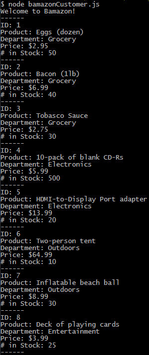
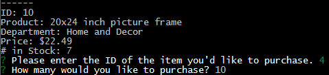
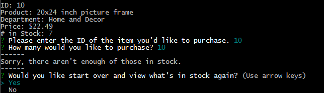
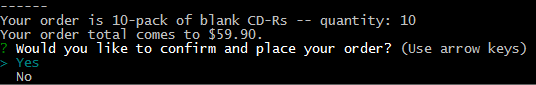
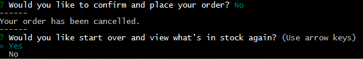
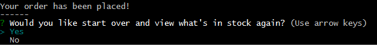

# Bamazon
## A store-front app for Node.js and MySQL

### When launched in the terminal, the app will first display all of the items in the products table within the Bamazon database.

### The user will then be prompted to enter the ID of the item they want to buy, then the quantity in which they want to buy it.

### If there isn't enough of the requested product in stock, the app will alert the user and prompt to either start again or quit.

### The app will then display the user's order, including the total price, and then prompt them to confirm.

### If the user does not confirm the order, it's cancelled and they're prompted to either start again or quit.

### If the user does confirm the order, it's placed and the number of units that they ordered will be removed from the stock in the database. The user is prompted to display products again (which will be updated to reflect the new stock levels) or to quit the app.

